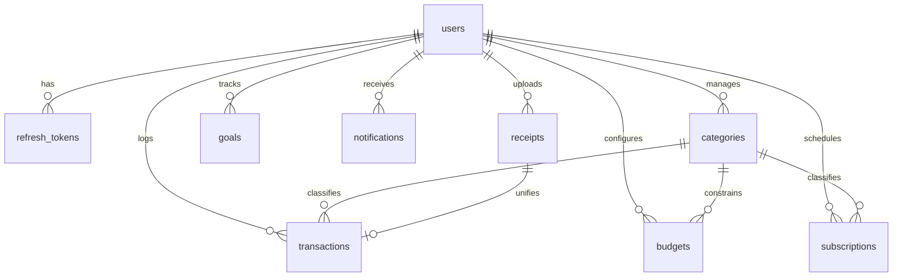

# SpendSense Project Knowledge Base

This document is the single source of truth for **SpendSense** — an AI-powered Personal Finance Assistant. It contains our architecture decisions, APIs, dependencies, environment variables, features, limitations, and future improvements.

---

## 1. Project Overview & Architecture

SpendSense is structured as an **npm workspaces Monorepo** containing two decoupled projects:
- `backend`: Node.js, Express, and TypeScript application.
- `frontend`: React, TypeScript, and Vite single-page application (SPA).

```
spendsense (Root Monorepo)
├── backend/                  # REST API server (Clean Architecture)
└── frontend/                 # Client UI (Vite + React + TailwindCSS)
```

---

## 2. Directory Layouts

### Backend (`/backend`)
We utilize **Clean Architecture** patterns to separate technical frameworks (Express) from business rules and database models:
- **`src/app.ts`**: Express application setup, security middlewares, and error handlers.
- **`src/server.ts`**: Entry point that binds to the port and handles process lifecycles (graceful shutdown).
- **`src/config/`**: Configuration and environmental validation using Zod (`src/config/env.ts`).
- **`src/database/`**: Database Client singleton initialization (`src/database/prisma.ts`).
- **`src/controllers/`**: HTTP Request/Response parser and handler layer.
- **`src/services/`**: Core business domain logic (calculators, reports, AI logic).
- **`src/repositories/`**: Repository layer separating raw database queries from controllers/services:
  - `BaseRepository.ts` (abstract CRUD utility class)
  - `UserRepository.ts`
  - `RefreshTokenRepository.ts`
  - `CategoryRepository.ts`
  - `TransactionRepository.ts`
  - `BudgetRepository.ts`
  - `GoalRepository.ts`
  - `SubscriptionRepository.ts`
  - `NotificationRepository.ts`
  - `ReceiptRepository.ts`
- **`src/routes/`**: Express Router mappings linking endpoints to controllers.
- **`src/middleware/`**: Security filters, JWT authentication parser, rate limiters, error captures, Zod validator injectors.
- **`src/validators/`**: Input validation schemas defined using Zod.
- **`src/utils/`**: Helper methods (JWT verification, formatting helpers, encryption).

### Frontend (`/frontend`)
We utilize a colocated **feature-based** and **layer-based** directory structure:
- **`src/main.tsx`**: Bootstraps and mounts the React virtual DOM.
- **`src/App.tsx`**: Setup routing, provider trees (React Query, Context), and root layout.
- **`src/components/ui/`**: Low-level UI primitives (buttons, modals, skeleton loaders, toasters).
- **`src/components/common/`**: Universal navigation, footer, layouts.
- **`src/features/`**: Feature-specific views (auth, dashboard, expenses, savings).
- **`src/services/`**: Network requests and custom caching hooks (Axios, React Query wrappers).
- **`src/hooks/`**: Custom hooks (`useLocalStorage`, `useDebounce`, etc.).
- **`src/utils/`**: Utility logic (formatting currency, parsing dates).

---

## 3. Tech Stack & Dependencies

### Global/Root
- **PackageManager**: npm workspaces
- **TypeScript**: Shared base configuration at root (`tsconfig.json`) targeting `ES2022`.

### Backend
- **Node & Express**: Foundation server framework.
- **helmet**: Middleware for setting security-related HTTP headers.
- **cors**: Enables cross-origin requests from the client app.
- **morgan**: HTTP request logger middleware.
- **winston**: Structured logs framework for production auditing.
- **zod**: Schema validation for incoming request bodies, params, and queries.
- **bcryptjs**: Blowfish-based password hashing.
- **jsonwebtoken**: Bearer token creation and validation.
- **multer**: Handles multipart/form-data for receipt image uploads.
- **prisma**: Database query mapper (ORM) targeting PostgreSQL.
- **ts-node-dev**: Direct execution of TypeScript files with auto-reload capabilities.

### Frontend
- **Vite**: Rapid-bundling SPA developer server.
- **React & React-DOM**: Component UI architecture.
- **react-router-dom**: Browser route management (SPA).
- **@tanstack/react-query**: Server state caching, background refetching, and mutations manager.
- **axios**: Client network request framework.
- **react-hook-form**: Form performance management.
- **@hookform/resolvers**: Validation bridge connecting React Hook Form with Zod.
- **zod**: Runtime client form validation.
- **recharts**: SVG-based responsive data charting.
- **lucide-react**: Lightweight icon set.
- **tailwindcss**: Utility-first styling framework.
- **tailwind-merge & clsx**: Dynamic utility class composition.

---

## 4. Environment Variables

### Backend
| Variable | Description | Default / Example | Required in Prod |
| :--- | :--- | :--- | :--- |
| `PORT` | Local server port | `5001` | No (Managed by Cloud) |
| `NODE_ENV` | Environment identifier | `development` | Yes (`production`) |
| `DATABASE_URL` | Prisma DB connection connection string | (Neon Postgres URI) | Yes |
| `JWT_SECRET` | Secret key used to sign Access Tokens | (Secure String) | Yes |
| `JWT_REFRESH_SECRET`| Secret key used to sign Refresh Tokens | (Secure String) | Yes |
| `GEMINI_API_KEY` | Key for natural language parsing/insights | (Google AI API Key) | Yes |

---

## 5. Database Schema Design

We use a PostgreSQL database mapped via Prisma ORM. All model identifiers are randomized **UUIDs** to support seamless sharding and secure client-side lookups.

### 5.1 Enums
1. `CategoryType`: `INCOME` | `EXPENSE`
2. `SubscriptionFrequency`: `WEEKLY` | `MONTHLY` | `YEARLY`
3. `NotificationType`: `BUDGET_EXCEEDED` | `SUBSCRIPTION_RENEWAL` | `SAVINGS_REMINDER` | `SYSTEM`

### 5.2 Schema Models & Relationships



1. **User (`users`)**
   - PK: `id` (UUID)
   - Columns: `email` (Unique), `passwordHash`, `firstName`, `lastName`, `createdAt`, `updatedAt`
2. **RefreshToken (`refresh_tokens`)**
   - PK: `id` (UUID)
   - Columns: `token` (Unique), `expiresAt`, `userId` (FK -> users)
   - Cascade: Deletes if parent User is deleted.
3. **Category (`categories`)**
   - PK: `id` (UUID)
   - Columns: `name`, `type` (CategoryType), `icon`, `color`, `userId` (FK -> users, nullable for system defaults)
   - Constraints: Composite unique check on `[name, userId]` prevents duplicates per scope.
4. **Transaction (`transactions`)**
   - PK: `id` (UUID)
   - Columns: `amount` (Decimal 12,2), `description`, `merchant`, `date`, `type` (CategoryType), `paymentMethod`, `isSubscription`, `userId` (FK -> users), `categoryId` (FK -> categories), `receiptId` (FK -> receipts, nullable, Unique)
   - Cascade: Deletes if User/Category is deleted. Clear association (`SetNull`) if associated Receipt is deleted.
5. **Budget (`budgets`)**
   - PK: `id` (UUID)
   - Columns: `amount` (Decimal 12,2), `startDate`, `endDate`, `userId` (FK -> users), `categoryId` (FK -> categories)
   - Cascade: Deletes if User/Category is deleted.
6. **Goal (`goals`)**
   - PK: `id` (UUID)
   - Columns: `name`, `targetAmount` (Decimal 12,2), `currentAmount` (Decimal 12,2, default 0), `targetDate`, `userId` (FK -> users)
7. **Subscription (`subscriptions`)**
   - PK: `id` (UUID)
   - Columns: `name`, `amount` (Decimal 12,2), `frequency` (SubscriptionFrequency), `startDate`, `nextRenewal`, `isActive`, `userId` (FK -> users), `categoryId` (FK -> categories, nullable)
8. **Notification (`notifications`)**
   - PK: `id` (UUID)
   - Columns: `title`, `message`, `isRead` (Boolean, default false), `type` (NotificationType), `userId` (FK -> users)
9. **Receipt (`receipts`)**
   - PK: `id` (UUID)
   - Columns: `imageUrl`, `rawText`, `extractedMerchant`, `extractedAmount` (Decimal 12,2), `extractedDate`, `userId` (FK -> users)

---

## 6. API Reference

### Health Checks
#### Check Server Vitality
- **URL**: `/health`
- **Method**: `GET`
- **Auth Required**: No
- **Success Response**: `200 OK`
  ```json
  {
    "status": "ok",
    "timestamp": "2026-07-14T14:30:33.280Z",
    "message": "SpendSense API is running smoothly"
  }
  ```

### Authentication Endpoints
#### User Registration
- **URL**: `/api/auth/register`
- **Method**: `POST`
- **Auth Required**: No
- **Rate Limited**: Yes (15 requests / 15 minutes)
- **Request Body**:
  ```json
  {
    "firstName": "Jane",
    "lastName": "Doe",
    "email": "jane.doe@example.com",
    "password": "Password123!"
  }
  ```
- **Success Response (201 Created)**:
  ```json
  {
    "status": "success",
    "data": {
      "user": {
        "id": "uuid-string",
        "email": "jane.doe@example.com",
        "firstName": "Jane",
        "lastName": "Doe",
        "createdAt": "2026-07-14T14:41:00.000Z"
      }
    }
  }
  ```

#### User Login
- **URL**: `/api/auth/login`
- **Method**: `POST`
- **Auth Required**: No
- **Rate Limited**: Yes (15 requests / 15 minutes)
- **Request Body**:
  ```json
  {
    "email": "jane.doe@example.com",
    "password": "Password123!"
  }
  ```
- **Success Response (200 OK)**:
  ```json
  {
    "status": "success",
    "data": {
      "tokens": {
        "accessToken": "eyJhbG...",
        "refreshToken": "eyJhbG..."
      },
      "user": {
        "id": "uuid-string",
        "email": "jane.doe@example.com",
        "firstName": "Jane",
        "lastName": "Doe",
        "createdAt": "2026-07-14T14:41:00.000Z"
      }
    }
  }
  ```

#### Token Refresh (Rotation)
- **URL**: `/api/auth/refresh`
- **Method**: `POST`
- **Auth Required**: No (Verified via Body Refresh Token)
- **Request Body**:
  ```json
  {
    "refreshToken": "eyJhbG..."
  }
  ```
- **Success Response (200 OK)**:
  ```json
  {
    "status": "success",
    "data": {
      "tokens": {
        "accessToken": "new-access-token-string",
        "refreshToken": "new-refresh-token-string"
      }
    }
  }
  ```

#### User Logout
- **URL**: `/api/auth/logout`
- **Method**: `POST`
- **Auth Required**: No (Revokes via Body Refresh Token)
- **Request Body**:
  ```json
  {
    "refreshToken": "eyJhbG..."
  }
  ```
- **Success Response (200 OK)**:
  ```json
  {
    "status": "success",
    "message": "Logged out successfully"
  }
  ```

#### Fetch Profile
- **URL**: `/api/auth/me`
- **Method**: `GET`
- **Auth Required**: Yes (Bearer Access Token)
- **Success Response (200 OK)**:
  ```json
  {
    "status": "success",
    "data": {
      "user": {
        "id": "uuid-string",
        "email": "jane.doe@example.com",
        "firstName": "Jane",
        "lastName": "Doe",
        "createdAt": "2026-07-14T14:41:00.000Z"
      }
    }
  }
  ```

---

## 7. Architecture & Implementation Decisions

### 1. CommonJS for Backend Compilation
- **Decision**: Configured backend compiler target module to `CommonJS` rather than `ESM` (`NodeNext`).
- **Rationale**: `ts-node-dev` handles CJS imports out of the box with zero runtime path configuration. Running ESM locally requires additional node loaders (`ts-node/esm`) which are less stable.
- **Trade-off**: Slightly larger bundle/require footprint, which has negligible impact on standard server-side Node execution.

### 2. Vite Path Aliasing
- **Decision**: Aliased `/src` to `@` in both `tsconfig.json` and `vite.config.ts`.
- **Rationale**: Avoids long relative traversal paths like `../../../../components/Button` in components, reducing imports syntax overhead and facilitating features relocation.

### 3. Decoupling Express setup from HTTP binding
- **Decision**: Separated `app.ts` (Express instance initialization) from `server.ts` (TCP port listen operation).
- **Rationale**: Allows testing endpoints directly using libraries like `supertest` without spawning a real network server. This speeds up integration test runtimes and prevents port lock issues.

### 4. Database Indexing Layout
- **Decision**: Created index structures for:
  - `refresh_tokens(token)`
  - `transactions(userId, date)` (sorting checks)
  - `transactions(userId, categoryId)` (aggregation checks)
  - `budgets(userId, categoryId)` (active limit constraints)
  - `subscriptions(userId, nextRenewal)` (billing notifications)
  - `notifications(userId, isRead)` (unread tray checks)
- **Rationale**: Mitigates full-table scan degradation as user numbers scale to millions, ensuring dashboard loading under 100ms.

### 5. Repository Pattern Implementation
- **Decision**: Implemented `BaseRepository` wrapping the Prisma Client, extending it to feature-specific repositories.
- **Rationale**: Isolates Prisma raw client API from the express controllers and domain services, allowing simplified mocking for tests and abstracting DB client APIs.

### 6. Decimal Precision (`Decimal(12, 2)`)
- **Decision**: Mapped financial values to Postgres `Decimal(12,2)` rather than `Float`.
- **Rationale**: Floating-point rounding discrepancies lead to transaction inconsistencies. Exact decimals maintain absolute ledger integrity.

### 7. Custom Toast Implementation
- **Decision**: Wrote a custom React Toast Provider and Hook rather than importing a third-party module (like `react-toastify`).
- **Rationale**: Keeps frontend bundle size small, conforms to our strict custom obsidian/dark design guidelines, and demonstrates UI coding capability during project walk-throughs.

---

## 8. Authentication Architecture & Token Lifecycle

### 8.1 JWT Authentication Flow
1. **Client Request**: Client issues credentials to `/api/auth/login`.
2. **Server Check**: Server verifies user email, compares password using Bcrypt, and generates:
   - **Access Token**: Short-lived (15 minutes), stateless JWT containing `{ userId, email }`. Signed with `JWT_SECRET`.
   - **Refresh Token**: Long-lived (30 days) random UUID/JWT string. Signed with `JWT_REFRESH_SECRET` and saved to the database.
3. **Client Storage**: Client saves both tokens in LocalStorage.
4. **API Requests**: On every subsequent API request, the Axios request interceptor automatically attaches the access token: `Authorization: Bearer <accessToken>`.
5. **Gateway Auth**: Backend middleware `authenticateUser()` verifies the signature. If valid, request proceeds; if expired, server returns `401 Unauthorized`.

### 8.2 Refresh Token Rotation (RTR)
To minimize token hijacking risks, Refresh Tokens are single-use. The lifecycle proceeds as follows:

```
[Client]                                                        [API Gateway]
   |                                                                  |
   |-- 1. GET /api/transactions (with Expired Access Token) --------->|
   |<-- 2. Return 401 Unauthorized (Token Expired) -------------------|
   |                                                                  |
   |-- 3. POST /api/auth/refresh (with stored RefreshToken-A) ------->|
   |                                                                  | [RTR Check]
   |                                                                  | - Verify RefreshToken-A exists in DB
   |                                                                  | - Delete RefreshToken-A (revoke)
   |                                                                  | - Generate AccessToken-B & RefreshToken-B
   |                                                                  | - Save RefreshToken-B in DB
   |<-- 4. Return AccessToken-B & RefreshToken-B ---------------------|
   |                                                                  |
   |-- 5. GET /api/transactions (with fresh AccessToken-B) ----------->|
   |<-- 6. Return 200 OK (Data Payload) ------------------------------|
```

---

## 9. Current Limitations & Technical Debt

- **Token Storage Vulnerability (LocalStorage)**: Frontend stores tokens in LocalStorage to operate seamlessly across separate host domains (Vercel client and Render API) without custom domain configurations. This is theoretically vulnerable to Cross-Site Scripting (XSS) attacks.
  - *Mitigation Plan*: In a production enterprise system, client and server should share a top-level domain, allowing tokens to be set in `HttpOnly` `Secure` cookies.
- **No Database Health Check**: `/health` API endpoint verifies Node server socket bindings but does not ping the Neon PostgreSQL database due to missing dev connection pools.

---

## 10. Interview Notes & Reference Answers

1. **Why use Refresh Token Rotation instead of leaving a refresh token static?**
   - *Answer*: If an attacker steals a static refresh token from a client (via XSS), they can request new access tokens indefinitely until the token expires in 30 days. Under rotation, refresh tokens are single-use. If the attacker tries to reuse a token, the database lookup fails because the legitimate user has already exchanged it and deleted it, instantly signaling that the session has been compromised.
2. **What is Bcrypt and why is it preferred over SHA-256 for passwords?**
   - *Answer*: SHA-256 is a fast cryptographic hashing algorithm designed for speed (e.g. file checksums). It can be brute-forced easily using GPUs. Bcrypt is a slow, blowfish-based key-stretching algorithm. It includes a configurable "work factor" (salt rounds) that intentionally delays execution. This makes password testing computationally expensive and highly resistant to GPU/ASIC hardware cracking.
3. **Explain how the frontend handles token expiration transparently without distracting the user.**
   - *Answer*: We configure an Axios response interceptor. When any API call returns `401 Unauthorized` (indicating the short-lived access token expired), the interceptor catches the failure, buffers any concurrent pending requests in a queue, calls the `/api/auth/refresh` endpoint to rotate the refresh token, updates LocalStorage, updates the failed request headers, and replays all queued requests. The user continues their dashboard session without seeing a logout or forced reload.

---

## 11. Git Commit History
```
feat(auth): implement JWT authentication with refresh token rotation

- Setup Zod validation schemas for registration, login, and token refresh
- Implement Bcrypt password hashing (work factor 10) and anti-enumeration logins
- Setup JWT utility helpers (15m Access Token, 30d Refresh Token)
- Implement Refresh Token Rotation (RTR) on the backend
- Scaffold UserRepository, RefreshTokenRepository, and catchAsync error-handler middlewares
- Add frontend React AuthContext, ProtectedRoute, and custom Toast alerts
- Integrate Axios interceptors to transparently capture 401s, rotate tokens, and replay requests
```
