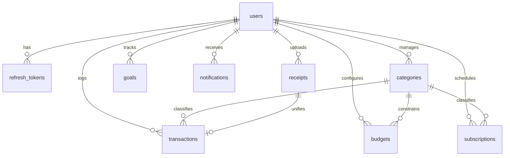

# SpendSense Project Knowledge Base

This document is the single source of truth for **SpendSense** — an AI-powered Personal Finance Assistant. It contains our architecture decisions, APIs, dependencies, environment variables, features, limitations, and future improvements.

---

## 1. Project Overview & Architecture

SpendSense is structured as an **npm workspaces Monorepo** containing two decoupled projects:
- `backend`: Node.js, Express, and TypeScript application.
- `frontend`: React, TypeScript, and Vite single-page application (SPA).

```
spendsense (Root Monorepo)
├── backend/                  # REST API server (Clean Architecture)
└── frontend/                 # Client UI (Vite + React + TailwindCSS)
```

---

## 2. Directory Layouts

### Backend (`/backend`)
We utilize **Clean Architecture** patterns to separate technical frameworks (Express) from business rules and database models:
- **`src/app.ts`**: Express application setup, security middlewares, and error handlers.
- **`src/server.ts`**: Entry point that binds to the port and handles process lifecycles (graceful shutdown).
- **`src/config/`**: Configuration and environmental validation using Zod (`src/config/env.ts`).
- **`src/database/`**: Database Client singleton initialization (`src/database/prisma.ts`).
- **`src/controllers/`**: HTTP Request/Response parser and handler layer.
- **`src/services/`**: Core business domain logic (calculators, reports, AI logic).
- **`src/repositories/`**: Repository layer separating raw database queries from controllers/services:
  - `BaseRepository.ts` (abstract CRUD utility class)
  - `UserRepository.ts`
  - `RefreshTokenRepository.ts`
  - `CategoryRepository.ts`
  - `TransactionRepository.ts`
  - `BudgetRepository.ts`
  - `GoalRepository.ts`
  - `SubscriptionRepository.ts`
  - `NotificationRepository.ts`
  - `ReceiptRepository.ts`
- **`src/routes/`**: Express Router mappings linking endpoints to controllers.
- **`src/middleware/`**: Security filters, JWT authentication parser, rate limiters, error captures, Zod validator injectors.
- **`src/validators/`**: Input validation schemas defined using Zod.
- **`src/utils/`**: Helper methods (JWT verification, formatting helpers, encryption).

### Frontend (`/frontend`)
We utilize a colocated **feature-based** and **layer-based** directory structure:
- **`src/main.tsx`**: Bootstraps and mounts the React virtual DOM.
- **`src/App.tsx`**: Setup routing, provider trees (React Query, Context), and root layout.
- **`src/components/ui/`**: Low-level UI primitives (buttons, modals, skeleton loaders, toasters).
- **`src/components/common/`**: Universal navigation, footer, layouts.
- **`src/features/`**: Feature-specific views (auth, dashboard, expenses, savings).
- **`src/services/`**: Network requests and custom caching hooks (Axios, React Query wrappers).
- **`src/hooks/`**: Custom hooks (`useLocalStorage`, `useDebounce`, etc.).
- **`src/utils/`**: Utility logic (formatting currency, parsing dates).

---

## 3. Tech Stack & Dependencies

### Global/Root
- **PackageManager**: npm workspaces
- **TypeScript**: Shared base configuration at root (`tsconfig.json`) targeting `ES2022`.

### Backend
- **Node & Express**: Foundation server framework.
- **helmet**: Middleware for setting security-related HTTP headers.
- **cors**: Enables cross-origin requests from the client app.
- **morgan**: HTTP request logger middleware.
- **winston**: Structured logs framework for production auditing.
- **zod**: Schema validation for incoming request bodies, params, and queries.
- **bcryptjs**: Blowfish-based password hashing.
- **jsonwebtoken**: Bearer token creation and validation.
- **multer**: Handles multipart/form-data for receipt image uploads.
- **prisma**: Database query mapper (ORM) targeting PostgreSQL.
- **ts-node-dev**: Direct execution of TypeScript files with auto-reload capabilities.

### Frontend
- **Vite**: Rapid-bundling SPA developer server.
- **React & React-DOM**: Component UI architecture.
- **react-router-dom**: Browser route management (SPA).
- **@tanstack/react-query**: Server state caching, background refetching, and mutations manager.
- **axios**: Client network request framework.
- **react-hook-form**: Form performance management.
- **@hookform/resolvers**: Validation bridge connecting React Hook Form with Zod.
- **zod**: Runtime client form validation.
- **recharts**: SVG-based responsive data charting.
- **lucide-react**: Lightweight icon set.
- **tailwindcss**: Utility-first styling framework.
- **tailwind-merge & clsx**: Dynamic utility class composition.

---

## 4. Environment Variables

### Backend
| Variable | Description | Default / Example | Required in Prod |
| :--- | :--- | :--- | :--- |
| `PORT` | Local server port | `5001` | No (Managed by Cloud) |
| `NODE_ENV` | Environment identifier | `development` | Yes (`production`) |
| `DATABASE_URL` | Prisma DB connection connection string | (Neon Postgres URI) | Yes |
| `JWT_SECRET` | Secret key used to sign Access Tokens | (Secure String) | Yes |
| `JWT_REFRESH_SECRET`| Secret key used to sign Refresh Tokens | (Secure String) | Yes |
| `GEMINI_API_KEY` | Key for natural language parsing/insights | (Google AI API Key) | Yes |

---

## 5. Database Schema Design

We use a PostgreSQL database mapped via Prisma ORM. All model identifiers are randomized **UUIDs** to support seamless sharding and secure client-side lookups.

### 5.1 Enums
1. `CategoryType`: `INCOME` | `EXPENSE`
2. `SubscriptionFrequency`: `WEEKLY` | `MONTHLY` | `YEARLY`
3. `NotificationType`: `BUDGET_EXCEEDED` | `SUBSCRIPTION_RENEWAL` | `SAVINGS_REMINDER` | `SYSTEM`

### 5.2 Schema Models & Relationships



1. **User (`users`)**
   - PK: `id` (UUID)
   - Columns: `email` (Unique), `passwordHash`, `firstName`, `lastName`, `createdAt`, `updatedAt`
2. **RefreshToken (`refresh_tokens`)**
   - PK: `id` (UUID)
   - Columns: `token` (Unique), `expiresAt`, `userId` (FK -> users)
   - Cascade: Deletes if parent User is deleted.
3. **Category (`categories`)**
   - PK: `id` (UUID)
   - Columns: `name`, `type` (CategoryType), `icon`, `color`, `userId` (FK -> users, nullable for system defaults)
   - Constraints: Composite unique check on `[name, userId]` prevents duplicates per scope.
4. **Transaction (`transactions`)**
   - PK: `id` (UUID)
   - Columns: `amount` (Decimal 12,2), `description`, `merchant`, `date`, `type` (CategoryType), `paymentMethod`, `isSubscription`, `userId` (FK -> users), `categoryId` (FK -> categories), `receiptId` (FK -> receipts, nullable, Unique)
   - Cascade: Deletes if User/Category is deleted. Clear association (`SetNull`) if associated Receipt is deleted.
5. **Budget (`budgets`)**
   - PK: `id` (UUID)
   - Columns: `amount` (Decimal 12,2), `startDate`, `endDate`, `userId` (FK -> users), `categoryId` (FK -> categories)
   - Cascade: Deletes if User/Category is deleted.
6. **Goal (`goals`)**
   - PK: `id` (UUID)
   - Columns: `name`, `targetAmount` (Decimal 12,2), `currentAmount` (Decimal 12,2, default 0), `targetDate`, `userId` (FK -> users)
7. **Subscription (`subscriptions`)**
   - PK: `id` (UUID)
   - Columns: `name`, `amount` (Decimal 12,2), `frequency` (SubscriptionFrequency), `startDate`, `nextRenewal`, `isActive`, `userId` (FK -> users), `categoryId` (FK -> categories, nullable)
8. **Notification (`notifications`)**
   - PK: `id` (UUID)
   - Columns: `title`, `message`, `isRead` (Boolean, default false), `type` (NotificationType), `userId` (FK -> users)
9. **Receipt (`receipts`)**
   - PK: `id` (UUID)
   - Columns: `imageUrl`, `rawText`, `extractedMerchant`, `extractedAmount` (Decimal 12,2), `extractedDate`, `userId` (FK -> users)

---

## 6. API Reference

### Health Checks
#### Check Server Vitality
- **URL**: `/health`
- **Method**: `GET`
- **Auth Required**: No
- **Success Response**: `200 OK`
  ```json
  {
    "status": "ok",
    "timestamp": "2026-07-14T14:30:33.280Z",
    "message": "SpendSense API is running smoothly"
  }
  ```

### Authentication Endpoints
#### User Registration
- **URL**: `/api/auth/register`
- **Method**: `POST`
- **Auth Required**: No
- **Rate Limited**: Yes (15 requests / 15 minutes)
- **Request Body**:
  ```json
  {
    "firstName": "Jane",
    "lastName": "Doe",
    "email": "jane.doe@example.com",
    "password": "Password123!"
  }
  ```
- **Success Response (201 Created)**:
  ```json
  {
    "status": "success",
    "data": {
      "user": {
        "id": "uuid-string",
        "email": "jane.doe@example.com",
        "firstName": "Jane",
        "lastName": "Doe",
        "createdAt": "2026-07-14T14:41:00.000Z"
      }
    }
  }
  ```

#### User Login
- **URL**: `/api/auth/login`
- **Method**: `POST`
- **Auth Required**: No
- **Rate Limited**: Yes (15 requests / 15 minutes)
- **Request Body**:
  ```json
  {
    "email": "jane.doe@example.com",
    "password": "Password123!"
  }
  ```
- **Success Response (200 OK)**:
  ```json
  {
    "status": "success",
    "data": {
      "tokens": {
        "accessToken": "eyJhbG...",
        "refreshToken": "eyJhbG..."
      },
      "user": {
        "id": "uuid-string",
        "email": "jane.doe@example.com",
        "firstName": "Jane",
        "lastName": "Doe",
        "createdAt": "2026-07-14T14:41:00.000Z"
      }
    }
  }
  ```

#### Token Refresh (Rotation)
- **URL**: `/api/auth/refresh`
- **Method**: `POST`
- **Auth Required**: No (Verified via Body Refresh Token)
- **Request Body**:
  ```json
  {
    "refreshToken": "eyJhbG..."
  }
  ```
- **Success Response (200 OK)**:
  ```json
  {
    "status": "success",
    "data": {
      "tokens": {
        "accessToken": "new-access-token-string",
        "refreshToken": "new-refresh-token-string"
      }
    }
  }
  ```

#### User Logout
- **URL**: `/api/auth/logout`
- **Method**: `POST`
- **Auth Required**: No (Revokes via Body Refresh Token)
- **Request Body**:
  ```json
  {
    "refreshToken": "eyJhbG..."
  }
  ```
- **Success Response (200 OK)**:
  ```json
  {
    "status": "success",
    "message": "Logged out successfully"
  }
  ```

#### Fetch Profile
- **URL**: `/api/auth/me`
- **Method**: `GET`
- **Auth Required**: Yes (Bearer Access Token)
- **Success Response (200 OK)**:
  ```json
  {
    "status": "success",
    "data": {
      "user": {
        "id": "uuid-string",
        "email": "jane.doe@example.com",
        "firstName": "Jane",
        "lastName": "Doe",
        "createdAt": "2026-07-14T14:41:00.000Z"
      }
    }
  }
  ```

### Transaction Endpoints
All transaction endpoints require a valid JWT Bearer access token in the `Authorization` header.

#### Create Transaction
- **URL**: `/api/transactions`
- **Method**: `POST`
- **Request Body**:
  ```json
  {
    "amount": 250.50,
    "description": "Dinner at Pizza place",
    "merchant": "Dominos",
    "date": "2026-07-14T15:00:00.000Z",
    "type": "EXPENSE",
    "paymentMethod": "Card",
    "categoryId": "category-uuid-string",
    "isSubscription": false
  }
  ```
- **Success Response (201 Created)**:
  ```json
  {
    "status": "success",
    "data": {
      "transaction": {
        "id": "tx-uuid-string",
        "amount": "250.5",
        "description": "Dinner at Pizza place",
        "merchant": "Dominos",
        "date": "2026-07-14T15:00:00.000Z",
        "type": "EXPENSE",
        "paymentMethod": "Card",
        "isSubscription": false,
        "userId": "user-uuid-string",
        "categoryId": "category-uuid-string",
        "receiptId": null,
        "createdAt": "2026-07-14T15:00:05.000Z",
        "updatedAt": "2026-07-14T15:00:05.000Z"
      }
    }
  }
  ```

#### Fetch Filtered & Paginated Transactions
- **URL**: `/api/transactions`
- **Method**: `GET`
- **Query Parameters**:
  - `page`: default `1`
  - `limit`: default `10`
  - `search`: filters merchant/description (case-insensitive substring)
  - `categoryId`: filter by category ID
  - `type`: filter by type (`INCOME`/`EXPENSE`)
  - `isSubscription`: filter by recurring billing (`true`/`false`)
  - `startDate`, `endDate`: filter by ISO date ranges
  - `sortBy`: sort column, default `date`
  - `sortOrder`: sort direction (`asc`/`desc`), default `desc`
- **Success Response (200 OK)**:
  ```json
  {
    "status": "success",
    "data": {
      "transactions": [
        {
          "id": "tx-uuid-string",
          "amount": "250.5",
          "merchant": "Dominos",
          "date": "2026-07-14T15:00:00.000Z",
          "type": "EXPENSE",
          "category": {
            "name": "Food",
            "icon": "Utensils",
            "color": "#f43f5e"
          }
        }
      ],
      "pagination": {
        "total": 1,
        "page": 1,
        "limit": 10,
        "pages": 1
      }
    }
  }
  ```

#### Fetch Transaction Details
- **URL**: `/api/transactions/:id`
- **Method**: `GET`
- **Success Response (200 OK)**:
  ```json
  {
    "status": "success",
    "data": {
      "transaction": {
        "id": "tx-uuid-string",
        "amount": "250.5",
        "description": "Dinner at Pizza place",
        "merchant": "Dominos",
        "date": "2026-07-14T15:00:00.000Z",
        "type": "EXPENSE",
        "paymentMethod": "Card",
        "userId": "user-uuid-string",
        "categoryId": "category-uuid-string",
        "receiptId": null
      }
    }
  }
  ```

#### Update Transaction
- **URL**: `/api/transactions/:id`
- **Method**: `PUT`
- **Request Body** (all fields optional):
  ```json
  {
    "amount": 270.00,
    "description": "Dinner and Drinks"
  }
  ```
- **Success Response (200 OK)**:
  ```json
  {
    "status": "success",
    "data": {
      "transaction": {
        "id": "tx-uuid-string",
        "amount": "270",
        "description": "Dinner and Drinks",
        "userId": "user-uuid-string",
        "categoryId": "category-uuid-string"
      }
    }
  }
  ```

#### Delete Transaction
- **URL**: `/api/transactions/:id`
- **Method**: `DELETE`
- **Success Response (200 OK)**:
  ```json
  {
    "status": "success",
    "message": "Transaction deleted successfully"
  }
  ```

### Category Endpoints
#### Fetch Available Categories
- **URL**: `/api/categories`
- **Method**: `GET`
- **Success Response (200 OK)**:
  ```json
  {
    "status": "success",
    "data": {
      "categories": [
        {
          "id": "category-uuid-string",
          "name": "Food",
          "type": "EXPENSE",
          "icon": "Utensils",
          "color": "#f43f5e",
          "userId": null
        }
      ]
    }
  }
  ```

### Budget Endpoints
All budget endpoints require a valid JWT Bearer access token in the `Authorization` header.

#### Setup Budget
- **URL**: `/api/budgets`
- **Method**: `POST`
- **Request Body**:
  ```json
  {
    "amount": 1000.00,
    "startDate": "2026-07-01T00:00:00.000Z",
    "endDate": "2026-07-31T23:59:59.999Z",
    "categoryId": "category-uuid-string"
  }
  ```
- **Success Response (201 Created)**:
  ```json
  {
    "status": "success",
    "data": {
      "budget": {
        "id": "budget-uuid-string",
        "amount": 1000,
        "startDate": "2026-07-01T00:00:00.000Z",
        "endDate": "2026-07-31T23:59:59.999Z",
        "userId": "user-uuid-string",
        "categoryId": "category-uuid-string",
        "spent": 250,
        "remaining": 750,
        "percentageUsed": 25,
        "isWarning": false,
        "isExceeded": false
      }
    }
  }
  ```

#### Fetch Budgets List
- **URL**: `/api/budgets`
- **Method**: `GET`
- **Success Response (200 OK)**:
  ```json
  {
    "status": "success",
    "data": {
      "budgets": [
        {
          "id": "budget-uuid-string",
          "amount": 1000,
          "startDate": "2026-07-01T00:00:00.000Z",
          "endDate": "2026-07-31T23:59:59.999Z",
          "userId": "user-uuid-string",
          "categoryId": null,
          "category": null,
          "spent": 850,
          "remaining": 150,
          "percentageUsed": 85,
          "isWarning": true,
          "isExceeded": false
        }
      ]
    }
  }
  ```

#### Update Budget
- **URL**: `/api/budgets/:id`
- **Method**: `PUT`
- **Request Body**:
  ```json
  {
    "amount": 1200.00
  }
  ```
- **Success Response (200 OK)**:
  ```json
  {
    "status": "success",
    "data": {
      "budget": {
        "id": "budget-uuid-string",
        "amount": 1200,
        "spent": 850,
        "remaining": 350,
        "percentageUsed": 70.8,
        "isWarning": false,
        "isExceeded": false
      }
    }
  }
  ```

#### Delete Budget
- **URL**: `/api/budgets/:id`
- **Method**: `DELETE`
- **Success Response (200 OK)**:
  ```json
  {
    "status": "success",
    "message": "Budget deleted successfully"
  }
  ```

### Savings Goals Endpoints
All goal endpoints require a valid JWT Bearer access token in the `Authorization` header.

#### Create Goal
- **URL**: `/api/goals`
- **Method**: `POST`
- **Request Body**:
  ```json
  {
    "name": "Emergency Fund",
    "targetAmount": 10000.00,
    "targetDate": "2027-12-31T00:00:00.000Z"
  }
  ```
- **Success Response (201 Created)**:
  ```json
  {
    "status": "success",
    "data": {
      "goal": {
        "id": "goal-uuid-string",
        "name": "Emergency Fund",
        "targetAmount": 10000,
        "currentAmount": 0,
        "targetDate": "2027-12-31T00:00:00.000Z",
        "userId": "user-uuid-string",
        "progressPercentage": 0,
        "remainingAmount": 10000,
        "daysRemaining": 534,
        "isCompleted": false
      }
    }
  }
  ```

#### Contribute to Goal
- **URL**: `/api/goals/:id/contribute`
- **Method**: `POST`
- **Request Body**:
  ```json
  {
    "amount": 500.00
  }
  ```
- **Success Response (200 OK)**:
  ```json
  {
    "status": "success",
    "data": {
      "goal": {
        "id": "goal-uuid-string",
        "name": "Emergency Fund",
        "targetAmount": 10000,
        "currentAmount": 500,
        "progressPercentage": 5,
        "remainingAmount": 9500,
        "isCompleted": false
      }
    }
  }
  ```

### Receipt Scanner Endpoints
All receipt endpoints require a valid JWT Bearer access token in the `Authorization` header.

#### Upload & Scan Receipt
- **URL**: `/api/receipts/upload`
- **Method**: `POST`
- **Content-Type**: `multipart/form-data`
- **Body Field**: `receipt` (image file — JPG, JPEG, PNG, WEBP, max 5 MB)
- **Success Response (201 Created)**:
  ```json
  {
    "status": "success",
    "data": {
      "receipt": {
        "id": "receipt-uuid-string",
        "createdAt": "2026-07-15T18:00:00.000Z"
      },
      "extraction": {
        "merchant": "Starbucks",
        "amount": 4.50,
        "date": "2026-07-15",
        "currency": "USD",
        "suggestedCategory": "Food",
        "description": "Coffee purchase",
        "confidence": 0.95
      }
    }
  }
  ```

#### Fetch All Receipts
- **URL**: `/api/receipts`
- **Method**: `GET`
- **Success Response (200 OK)**:
  ```json
  {
    "status": "success",
    "data": {
      "receipts": [
        {
          "id": "receipt-uuid-string",
          "imageUrl": "data:image/png;base64,...",
          "extractedMerchant": "Starbucks",
          "extractedAmount": "4.5",
          "extractedDate": "2026-07-15T00:00:00.000Z",
          "createdAt": "2026-07-15T18:00:00.000Z"
        }
      ]
    }
  }
  ```

#### Delete Receipt
- **URL**: `/api/receipts/:id`
- **Method**: `DELETE`
- **Success Response (200 OK)**:
  ```json
  {
    "status": "success",
    "message": "Receipt deleted successfully"
  }
  ```

  ```

### Subscription Endpoints
All subscription endpoints require a valid JWT Bearer access token in the `Authorization` header.

#### Create Subscription
- **URL**: `/api/subscriptions`
- **Method**: `POST`
- **Body**:
  ```json
  {
    "name": "Netflix",
    "amount": 15.99,
    "frequency": "MONTHLY",
    "startDate": "2026-07-15",
    "categoryId": "uuid",
    "isActive": true
  }
  ```
- **Success Response (201 Created)**: Returns the subscription object with calculated `nextRenewal`, `daysUntilRenewal`, `monthlyEquivalentCost`, and `annualCost`.

#### Fetch All Subscriptions
- **URL**: `/api/subscriptions`
- **Method**: `GET`
- **Success Response (200 OK)**: Returns an array of subscription objects with calculated stats, ordered by `nextRenewal` ascending. Any overdue active subscriptions will have their `nextRenewal` date automatically rolled forward based on their frequency.

#### Update Subscription
- **URL**: `/api/subscriptions/:id`
- **Method**: `PUT`
- **Body**: Any subset of the create body fields.
- **Success Response (200 OK)**: Returns the updated subscription.

#### Delete Subscription
- **URL**: `/api/subscriptions/:id`
- **Method**: `DELETE`
- **Success Response (200 OK)**: `{"status": "success", "message": "Subscription deleted successfully"}`

---

## 7. Architecture & Implementation Decisions

### 1. CommonJS for Backend Compilation
- **Decision**: Configured backend compiler target module to `CommonJS` rather than `ESM` (`NodeNext`).
- **Rationale**: `ts-node-dev` handles CJS imports out of the box with zero runtime path configuration.

### 2. Vite Path Aliasing
- **Decision**: Aliased `/src` to `@` in both `tsconfig.json` and `vite.config.ts`.
- **Rationale**: Avoids long relative traversal paths like `../../../../components/Button` in components, reducing imports syntax overhead.

### 3. Decoupling Express setup from HTTP binding
- **Decision**: Separated `app.ts` (Express instance initialization) from `server.ts` (TCP port listen operation).
- **Rationale**: Allows testing endpoints directly using libraries like `supertest` without spawning a real network server.

### 4. Database Indexing Layout
- **Decision**: Created index structures for:
  - `refresh_tokens(token)`
  - `transactions(userId, date)` (sorting checks)
  - `transactions(userId, categoryId)` (aggregation checks)
  - `budgets(userId, categoryId)` (active limit constraints)
  - `subscriptions(userId, nextRenewal)` (billing notifications)
  - `notifications(userId, isRead)` (unread tray checks)
- **Rationale**: Mitigates full-table scan degradation as user numbers scale to millions, ensuring dashboard loading under 100ms.
### 4. Background Processing vs "Read-Time" Calculation
- **Decision**: Avoided background cron jobs for updating expired subscription renewal dates. Implemented "auto-roll forward on read" inside `SubscriptionService.processSubscription`.
- **Rationale**: SpendSense is designed for low infrastructural overhead. By recalculating and asynchronously saving the rolled-forward `nextRenewal` date during `GET` operations instead of via chron, we avoid needing external scheduling services like Redis/BullMQ.

### 5. Repository Pattern Implementation
- **Decision**: Implemented `BaseRepository` wrapping the Prisma Client, extending it to feature-specific repositories.
- **Rationale**: Isolates Prisma raw client API from the express controllers and domain services, allowing simplified mocking for tests.

### 6. Decimal Precision (`Decimal(12, 2)`)
- **Decision**: Mapped financial values to Postgres `Decimal(12,2)` rather than `Float`.
- **Rationale**: Floating-point rounding discrepancies lead to transaction inconsistencies. Exact decimals maintain absolute ledger integrity.

### 7. Custom Toast Implementation
- **Decision**: Wrote a custom React Toast Provider and Hook rather than importing a third-party module (like `react-toastify`).
- **Rationale**: Keeps frontend bundle size small and conforms to our strict custom obsidian/dark design guidelines.

### 8. Reusable Unified Transaction Form
- **Decision**: Created a single `TransactionForm` using React Hook Form + Zod resolver to govern both Create and Edit operations.
- **Rationale**: Prevents form-field replication, layout code drifts, and keeps validation schemas DRY.

### 9. Context-Preserving Overlay Modals
- **Decision**: Spun up form creations, transaction details, and delete confirmations inside backdrop overlay Modals instead of setting up routing endpoints like `/transactions/new`.
- **Rationale**: Retains the user's scroll depth and table state, improving UX.

### 10. Strict User Tenant Scoping
- **Decision**: Every service query filters by `userId` (e.g. `where: { id: transactionId, userId }`).
- **Rationale**: Restricts users from executing read/write/update/delete operations on other users' ledger entries, enforcing multi-tenant isolation.

### 11. Single-Endpoint Analytics Aggregation
- **Decision**: Implemented a unified `GET /api/dashboard` endpoint computing all financial metrics in one server pass.
- **Rationale**: Mitigates client waterfall requests, eliminates staggered loader visual states across different dashboard cards, and reduces server connection pool overhead.

### 12. Timezone-Stable Daily Trend Bucketing
- **Decision**: Daily spending trends for the last 30 days are generated as a dense date map (`YYYY-MM-DD`) in memory.
- **Rationale**: Standard SQL database grouping on raw timestamps splits records by exact milliseconds. Normalizing dates into ISO date strings in memory prevents timezone-shifted transaction buckets from dividing single calendar days into two.

### 13. Optional Category Budget Scope
- **Decision**: Set the database relation model key `categoryId` inside the `Budget` schema to be nullable.
- **Rationale**: Permits supporting both global overall monthly limits (where category is null) and category-specific budget targets within the same database model layout.

### 14. Query-Efficient spent calculation
- **Decision**: Spending progress against each budget is computed using single-pass Prisma `aggregate` calculations (`_sum: { amount: true }`) for the target start and end dates.
- **Rationale**: Yields lightweight SQL query calculations on indices, avoiding database transaction loading in Javascript memory.

### 15. Memory-Based Multer Storage for Receipt Uploads
- **Decision**: Used `multer.memoryStorage()` instead of disk storage for receipt image uploads.
- **Rationale**: Avoids writing temporary files to disk that require manual cleanup. The buffer is immediately passed to the Gemini API and then converted to a base64 data URL for database storage. This prevents orphaned files on failed uploads.

### 16. Isolated AI Service Layer
- **Decision**: Created a dedicated `AIService` class separate from `ReceiptService` for Gemini API communication.
- **Rationale**: Decouples AI provider logic from receipt CRUD business logic. If the AI provider changes (e.g., Gemini → OpenAI), only `AIService` needs modification. The receipt service remains unchanged.

### 17. Prefill-Not-Autocreate Transaction Pattern
- **Decision**: Receipt scanning extracts data and prefills the existing `TransactionForm` instead of automatically creating a transaction record.
- **Rationale**: AI extraction is probabilistic — merchants may be misread, amounts could include tax discrepancies, and dates may parse incorrectly. Requiring explicit user confirmation before saving maintains data integrity and prevents phantom ledger entries.

---

## 8. Authentication Architecture & Token Lifecycle

### 8.1 JWT Authentication Flow
1. **Client Request**: Client issues credentials to `/api/auth/login`.
2. **Server Check**: Server verifies user email, compares password using Bcrypt, and generates:
   - **Access Token**: Short-lived (15 minutes), stateless JWT containing `{ userId, email }`. Signed with `JWT_SECRET`.
   - **Refresh Token**: Long-lived (30 days) random UUID/JWT string. Signed with `JWT_REFRESH_SECRET` and saved to the database.
3. **Client Storage**: Client saves both tokens in LocalStorage.
4. **API Requests**: On every subsequent API request, the Axios request interceptor automatically attaches the access token: `Authorization: Bearer <accessToken>`.
5. **Gateway Auth**: Backend middleware `authenticateUser()` verifies the signature. If valid, request proceeds; if expired, server returns `401 Unauthorized`.

### 8.2 Refresh Token Rotation (RTR)
To minimize token hijacking risks, Refresh Tokens are single-use. The lifecycle proceeds as follows:

```
[Client]                                                        [API Gateway]
   |                                                                  |
   |-- 1. GET /api/transactions (with Expired Access Token) --------->|
   |<-- 2. Return 401 Unauthorized (Token Expired) -------------------|
   |                                                                  |
   |-- 3. POST /api/auth/refresh (with stored RefreshToken-A) ------->|
   |                                                                  | [RTR Check]
   |                                                                  | - Verify RefreshToken-A exists in DB
   |                                                                  | - Delete RefreshToken-A (revoke)
   |                                                                  | - Generate AccessToken-B & RefreshToken-B
   |                                                                  | - Save RefreshToken-B in DB
   |<-- 4. Return AccessToken-B & RefreshToken-B ---------------------|
   |                                                                  |
   |-- 5. GET /api/transactions (with fresh AccessToken-B) ----------->|
   |<-- 6. Return 200 OK (Data Payload) ------------------------------|
```

---

## 9. Current Limitations & Technical Debt

- **Token Storage Vulnerability (LocalStorage)**: Frontend stores tokens in LocalStorage to operate seamlessly across separate host domains (Vercel client and Render API) without custom domain configurations. This is theoretically vulnerable to Cross-Site Scripting (XSS) attacks.
  - *Mitigation Plan*: In a production enterprise system, client and server should share a top-level domain, allowing tokens to be set in `HttpOnly` `Secure` cookies.
- **No Database Health Check**: `/health` API endpoint verifies Node server socket bindings but does not ping the Neon PostgreSQL database due to missing dev connection pools.
- **Receipt Image Storage (Base64 in Database)**: Receipt images are stored as base64 data URLs in the PostgreSQL `imageUrl` field. This avoids external cloud dependencies during development but bloats the database for production scale.
  - *Mitigation Plan*: Migrate to cloud object storage (AWS S3 or Google Cloud Storage) and store only the signed URL reference in the database.

---

## 10. Interview Notes & Reference Answers

1. **Why use Refresh Token Rotation instead of leaving a refresh token static?**
   - *Answer*: If an attacker steals a static refresh token from a client (via XSS), they can request new access tokens indefinitely until the token expires in 30 days. Under rotation, refresh tokens are single-use. If the attacker tries to reuse a token, the database lookup fails because the legitimate user has already exchanged it and deleted it, instantly signaling that the session has been compromised.
2. **What is Bcrypt and why is it preferred over SHA-256 for passwords?**
   - *Answer*: SHA-256 is a fast cryptographic hashing algorithm designed for speed (e.g. file checksums). It can be brute-forced easily using GPUs. Bcrypt is a slow, blowfish-based key-stretching algorithm. It includes a configurable "work factor" (salt rounds) that intentionally delays execution. This makes password testing computationally expensive and highly resistant to GPU/ASIC hardware cracking.
3. **Explain how the frontend handles token expiration transparently without distracting the user.**
   - *Answer*: We configure an Axios response interceptor. When any API call returns `401 Unauthorized` (indicating the short-lived access token expired), the interceptor catches the failure, buffers any concurrent pending requests in a queue, calls the `/api/auth/refresh` endpoint to rotate the refresh token, updates LocalStorage, updates the failed request headers, and replays all queued requests. The user continues their dashboard session without seeing a logout or forced reload.
4. **How do you paginate database queries, and what is the difference between Offset and Keyset/Cursor pagination?**
   - *Answer*: We use Offset-based pagination with `skip` (OFFSET) and `take` (LIMIT) in SQL. It is simple to implement and allows direct jump to arbitrary page numbers. The trade-off is scale: `OFFSET 1000000` requires database engine to load all 1M records before discarding them, hurting performance. Keyset/Cursor pagination queries records based on the last seen timestamp (e.g., `WHERE date < last_seen_date LIMIT 10`), scanning only the target index branch `O(log N)` which scales linearly.
5. **How does React Query manage client-side state caching, and when do we invalidate it?**
   - *Answer*: React Query caches endpoint payloads under custom array-based identifiers called `queryKey` (e.g. `['transactions', filters]`). Subsequent components use this cache instead of calling network triggers. On data writes (mutations), we explicitly invoke `queryClient.invalidateQueries({ queryKey: ['transactions'] })`, forcing React Query to mark the existing cache as stale and refetch fresh data in the background.
6. **How do database aggregations (like SUM, GROUP BY) scale, and how do you optimize them?**
   - *Answer*: Database aggregations scan rows to compute totals. As rows scale into the millions, sequential scans block resources. Optimization is achieved by adding index keys matching filter categories (e.g. `@@index([userId, date])` or `@@index([userId, categoryId])`). This allows PostgreSQL to isolate matching index ranges instantly. For extremely high scale, we implement incremental rollups or cached materialized views pre-computed in background cron scripts.
7. **How does the AI Receipt Scanner handle unreliable Gemini API responses?**
   - *Answer*: The `AIService` implements a multi-layer defense strategy. First, the prompt explicitly requests JSON-only output with strict field naming. Second, the parser strips markdown code fences that Gemini sometimes wraps around JSON. Third, each field is individually type-checked — invalid types default to `null` rather than crashing. Fourth, negative amounts are rejected. Fifth, if JSON parsing fails entirely (garbled text), the system returns an empty extraction result so the user can still manually fill the form. The extraction is never auto-saved as a transaction — the user must explicitly confirm.

---

## 11. Git Commit History
```
feat(auth): implement JWT authentication with refresh token rotation

- Setup Zod validation schemas for registration, login, and token refresh
- Implement Bcrypt password hashing (work factor 10) and anti-enumeration logins
- Setup JWT utility helpers (15m Access Token, 30d Refresh Token)
- Implement Refresh Token Rotation (RTR) on the backend
- Scaffold UserRepository, RefreshTokenRepository, and catchAsync error-handler middlewares
- Add frontend React AuthContext, ProtectedRoute, and custom Toast alerts
- Integrate Axios interceptors to transparently capture 401s, rotate tokens, and replay requests

feat(expense): implement expense manager transaction CRUD log dashboard

- Setup Zod request schemas validating amounts (must be positive) and query filters
- Implement TransactionService and CategoryService enforcing user-tenant ownership checks
- Scaffold CategoryRoutes, TransactionRoutes, controllers, and error catch paths
- Add backend unit test suite verifying transaction scopes and category checks (10/10 test pass)
- Implement frontend React Query custom hooks for queries/mutations and cache invalidations
- Build reusable TransactionForm form, desktop TransactionTable grid, and mobile TransactionCard lists
- Build context modals for creations, details queries, and custom deletion confirmations
- Add layout tab navigations to DashboardHome and TransactionList views

feat(analytics): implement dashboard analytics view and widgets

- Implement DashboardService utilizing Prisma aggregate and groupBy functions
- Setup timezone-stable in-memory date bucket normalizers and division-by-zero guards
- Scaffold DashboardRoutes and controller handling auth verification scopes
- Add dashboard unit test suites verifying math aggregates and zero-income states (12/12 pass)
- Build frontend Recharts TrendChart (Area) and CategoryPieChart (Donut) components
- Build StatCards statistics cards, Top Merchants progress logs, and Recent Activity feed
- Integrate React Query caching hooks and mount Dashboard feature as secure root index

feat(budget): implement budget management caps CRUD board

- Modify Prisma schema setting categoryId nullable to support global overall limits
- Setup Zod validation schemas enforcing date-logical rules (endDate >= startDate)
- Implement BudgetService calculating spending metrics via Prisma SUM aggregates
- Add unit test suite verifying warning states (>=80%) and exceeded flags (>100%) (16/16 pass)
- Implement frontend React Query hooks invalidating cache values on mutations
- Build reusable BudgetForm dropdown form and BudgetProgress progress card widgets
- Build master BudgetList feature page listing budget limits and managing action modals
- Integrate active budget progress overview widget directly inside overview Dashboard view

feat(goals): implement savings goal tracking and contribution logs

- Setup Zod validation schemas for positive goals amounts and date bounds
- Implement GoalService dynamic calculators (progress percentage, remaining amount, completion checks)
- Scaffold GoalRoutes, GoalController, and GoalRepository enforcing strict tenant scope checks
- Add backend unit test suite verifying contribution math calculations and negative bounds checks
- Build frontend GoalCard display component showing detailed days-remaining constraints and trophies
- Build GoalContributionModal and GoalForm utilizing generic reactive component libraries
- Integrate top 3 pending Savings Goals Overview widget prominently into the primary Dashboard page

feat(receipt): implement AI-powered receipt scanner with Gemini integration

- Setup Multer memory storage middleware accepting JPG, PNG, WEBP with 5MB limit
- Implement isolated AIService for Gemini API integration with structured JSON prompts
- Implement ReceiptService orchestrating upload, AI extraction, and DB persistence
- Scaffold ReceiptRoutes, ReceiptController with CRUD endpoints (upload, list, get, delete)
- Add receipt unit test suite verifying AI JSON parsing, malformed responses, and tenant isolation (9/9 pass)
- Build frontend ReceiptScanner page with drag-and-drop upload and AI scanning animation
- Integrate extraction results into existing TransactionForm for user review before saving
- Add Scan navigation tab and /receipts route to application shell

feat(subscriptions): implement recurring subscription tracker and analytics

- Implement SubscriptionRepository and SubscriptionService enforcing tenant isolation
- Setup Zod schema validations for frequency enums (WEEKLY, MONTHLY, YEARLY) and positive amounts
- Build "auto-roll forward" date logic to seamlessly update overdue active subscriptions upon fetch
- Build backend unit test suite verifying date calculations, equivalent costs math, and isolation (7/7 pass)
- Integrate active subscription count, cost, and upcoming renewals directly into dashboard metrics payload
- Build React Query hooks, SubscriptionCard, SubscriptionFormModal, and SubscriptionList frontend interfaces
- Add SubscriptionsSummaryWidget to the primary Dashboard right-rail column
- Add Subscriptions tab to main App routing
```
